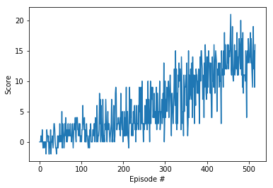

## Learning Algorithm
The algorithm can run in two modes, trained and untrained.

In the **trained mode** an agent is loaded and interacts with the environment. During the interaction there is no learning taken place, and it is used as a demostration of its capabilities.

In the **untrained mode** the agent learns a new task, consisting in picking yellow bananas while discarding blue ones. The agent was created implementing a DQN based on the code provided by Udacity: [dqn-agent](https://github.com/udacity/deep-reinforcement-learning/blob/master/dqn/solution/dqn_agent.py) and adapted to this environment.

The DQN contains two neural networks, the local ad the target. Both networks contain two fully-connected layers of 64 units each activated by the relu function and an output layer of 4 units, one per action. The agent contains also a replay buffer used to train the networks.

When the agent receives the state of the environment it uses the local network to choose the action to take. The action is sent to the environment, that returns the reward, new state and the status of the episode (finished or not). The agent stores the experience (state, action, reward, next state and episode status) in the replay buffer. Once every 4 episodes the agent enters in the 'learn' phase.

During the learn phase the agent randomly selects 64 experiences  and uses them to obtain a target Q table and a local Q table using the experiences and the networks. To obtain the target Q the discount factor is set to 0.99. Both Qs are used to compute the loss and softly update the weights of the target network to be 0.001 times the weights of the local network and 0.999 times the  weights of the target network.

This approach solves the problem in less than 400 episodes. Another solutions that were tested with worst results are:
* Update the weights of the target model replacing them with the values from the local model (no soft update). The agent is not able to continue learning after 200 episodes.
* Update the weights with soft update every episode. This approach solves the problem, but requires around 600 episodes to do it.

## Rewards
The graph below shows the average score obtained in the last 100 episodes. The agent solves the environment in around 400 episodes.

## Ideas For Future Work
This agent uses a dqn. It is probable to obtain better results using some (or all!) the known extension for dwn:
* Double DQN
* Prioritized Experience Replay
* Dueling DQN
* Multi-step Bootstrap Targets
* Distributional DQN
* Noisy DQN

A logical next step would be to apply the extensions to the current implementation.